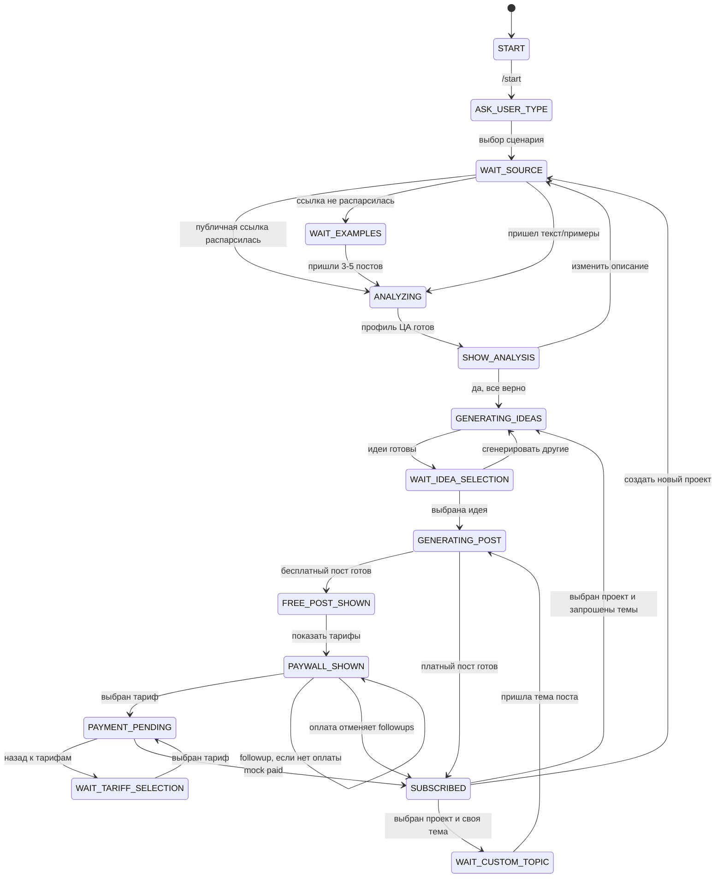

# Post Writer Bot

MVP Telegram-бота для генерации постов после короткого анализа аудитории.

## Запуск

1. Скопируйте env:

```bash
cp .env.example .env
```

2. Укажите в `.env` Supabase `DATABASE_URL`, `BOT_TOKEN` и остальные ключи.

3. Запустите сервисы:

```bash
docker compose -p mybot_prod up -d --build
```

API healthcheck:

```bash
curl http://localhost:8000/health
```

Telegram client API для входа user-аккаунтом Telethon:

```bash
curl http://localhost:8010/health
```

Если `OPENAI_API_KEY` не задан, бот использует mock LLM-ответы. Это удобно для проверки MVP-воронки без расходов на API.
Если `BOT_TOKEN` пустой, контейнеры `bot` и `scheduler` стартуют, но polling и отправка followup-сообщений отключаются.

## Env

- `BOT_TOKEN` - токен Telegram-бота.
- `DATABASE_URL` - обязательный Supabase Postgres DSN. Поддержаны direct connection, Session Pooler и Transaction Pooler.
- `REDIS_URL` - Redis DSN для RQ.
- `AUTO_INIT_DB` - по умолчанию `false`; схему и данные применяйте через SQL-миграции.
- `OPENAI_API_KEY` - ключ OpenAI или совместимого API.
- `OPENAI_BASE_URL` - опциональный base URL для OpenAI-compatible endpoint.
- `OPENAI_MODEL` - модель, по умолчанию `gpt-4o-mini`.
- `TELEGRAM_CLIENT_API_ID` - API ID из `my.telegram.org` для Telethon user-клиента.
- `TELEGRAM_CLIENT_API_HASH` - API hash из `my.telegram.org`.
- `TELEGRAM_CLIENT_DATA_DIR` - директория для Telethon session-файла, в Docker по умолчанию `/app/telegram_client_data`.
- `TELEGRAM_CLIENT_SESSION_NAME` - имя session-файла, по умолчанию `post_writer_client`.
- `TELEGRAM_CLIENT_ADMIN_TOKEN` - опциональный токен для `X-Admin-Token` на login-ручках.
- `FOLLOWUP_FAST_MODE` - `true` включает короткие интервалы догрева для тестов.
- `MOCK_PAYMENTS` - `true` включает mock-оплаты.
- `APP_ENV` - окружение, по умолчанию `production`.
- `API_HOST_PORT` - host-порт для API, по умолчанию `8000`.
- `TELEGRAM_CLIENT_API_HOST_PORT` - host-порт для Telegram client API, по умолчанию `8010`.

## Prod и dev на одном сервере

Используйте разные project name через `-p`, чтобы Compose создал разные контейнеры, сети и named volumes:

```bash
cd /srv/mybot/prod
docker compose -p mybot_prod up -d --build

cd /srv/mybot/dev
API_HOST_PORT=8001 TELEGRAM_CLIENT_API_HOST_PORT=8011 docker compose -p mybot_dev up -d --build
```

`-p mybot_prod` и `-p mybot_dev` разнесут контейнеры, например `mybot_prod-bot-1` и `mybot_dev-bot-1`, сети `mybot_prod_default` и `mybot_dev_default`, а также volume-ы `mybot_prod_telegram_client_data` и `mybot_dev_telegram_client_data`.

Host-порты не namespaced проектом Compose, поэтому dev должен использовать другие `API_HOST_PORT` и `TELEGRAM_CLIENT_API_HOST_PORT`, если prod уже занимает `8000` и `8010`.

## Вход Telegram user-аккаунтом

Сервис `telegram-client-api` поднимается на `http://localhost:8010`. Swagger доступен на `http://localhost:8010/docs`.

Перед входом заполните в `.env`:

```env
TELEGRAM_CLIENT_API_ID=123456
TELEGRAM_CLIENT_API_HASH=0123456789abcdef0123456789abcdef
TELEGRAM_CLIENT_ADMIN_TOKEN=local-secret
```

Порядок ручек:

```bash
curl -H "X-Admin-Token: local-secret" http://localhost:8010/telegram-client/status

curl -X POST http://localhost:8010/telegram-client/send-code \
  -H "Content-Type: application/json" \
  -H "X-Admin-Token: local-secret" \
  -d '{"phone":"+79990000000"}'

curl -X POST http://localhost:8010/telegram-client/sign-in \
  -H "Content-Type: application/json" \
  -H "X-Admin-Token: local-secret" \
  -d '{"code":"12345"}'
```

Если ответ `sign-in` вернул `{"status":"password_required"}`, пройдите 2FA:

```bash
curl -X POST http://localhost:8010/telegram-client/password \
  -H "Content-Type: application/json" \
  -H "X-Admin-Token: local-secret" \
  -d '{"password":"your-2fa-password"}'
```

Telethon session сохраняется в named volume `telegram_client_data` и переживает перезапуск контейнера. Локальная директория `telegram_client_data/` и файлы `*.session` добавлены в `.gitignore`.

## Проверка сценария

1. Напишите боту `/start`.
2. Выберите сценарий.
3. Отправьте описание ниши или 3-5 примеров постов.
4. Дождитесь анализа аудитории.
5. Подтвердите анализ.
6. Выберите идею.
7. Получите бесплатный пост.
8. Выберите тариф.
9. Нажмите `Оплатить / mock paid`.

Проверить таблицы и тарифы можно через Supabase Postgres URL:

```bash
psql "$SUPABASE_DB_URL" -c "\dt"
psql "$SUPABASE_DB_URL" -c "select * from tariffs;"
```

## Данные в Supabase

Приложение использует только Supabase Postgres через SQLAlchemy/asyncpg. Локальный Postgres в compose не поднимается, а `DATABASE_URL` без Supabase-хоста отклоняется на старте.

Для Docker-приложения удобнее использовать Session Pooler Supabase на порту `5432` или direct connection, если сервер поддерживает IPv6. Transaction Pooler на порту `6543` тоже поддержан в коде: для него автоматически включается `NullPool` и отключается cache prepared statements.

1. В Supabase Dashboard откройте `Connect` и возьмите Postgres connection string. Для restore используйте psql-совместимый URL, например:

```bash
export SUPABASE_DB_URL='postgresql://postgres.<project-ref>:<password>@aws-0-<region>.pooler.supabase.com:5432/postgres?sslmode=require'
```

Пароль в URL должен быть percent-encoded, если в нем есть спецсимволы.

2. Примените схему, подготовленный dump и RLS:

```bash
./scripts/restore_to_supabase.sh
```

По умолчанию скрипт загружает `tmp/supabase_migration/post_writer_bot_data.sql`. Он применяет схему, очищает прикладные таблицы, загружает dump, включает RLS, запускает `vacuum analyze`, сохраняет counts в `tmp/supabase_migration/supabase_counts.txt` и сверяет их с `source_counts.txt`, если файл есть рядом.

Если нужно создать пустую схему без dump, выполните:

```bash
psql "$SUPABASE_DB_URL" -v ON_ERROR_STOP=1 -f app/db/migrations/0001_initial.sql
psql "$SUPABASE_DB_URL" -v ON_ERROR_STOP=1 -f app/db/migrations/0002_seed_tariffs.sql
psql "$SUPABASE_DB_URL" -v ON_ERROR_STOP=1 -f app/db/migrations/0003_enable_rls.sql
```

3. Запустите приложение:

```bash
cp .env.example .env
# заполните DATABASE_URL, BOT_TOKEN, OPENAI_API_KEY
docker compose -p mybot_prod up -d --build
```

Для runtime `DATABASE_URL` можно указать как обычный Supabase Postgres URL (`postgres://` или `postgresql://`): приложение нормализует его в `postgresql+asyncpg://`. Для asyncpg используйте `ssl=require`; если оставите `sslmode=require`, приложение также преобразует параметр.

В Supabase включен RLS для таблиц в `public`. Политики не добавлены, потому что бот работает через backend Postgres connection, а не через Supabase Auth/Data API; это закрывает таблицы от `anon`/`authenticated` через REST до появления осознанной модели доступа.

Проверить основные таблицы после ручного сценария:

```sql
select * from users;
select * from projects;
select * from audience_profiles;
select * from ideas;
select * from posts;
select * from payments;
select * from subscriptions;
select * from followup_events;
```

## Автомат состояний



## Fast followup mode

Для ускоренной проверки догрева установите:

```env
FOLLOWUP_FAST_MODE=true
```

В этом режиме followup-сообщения планируются через минуты, а не часы.
По умолчанию fast-mode использует интервалы 2, 5, 10, 20, 30 и 47 минут.
