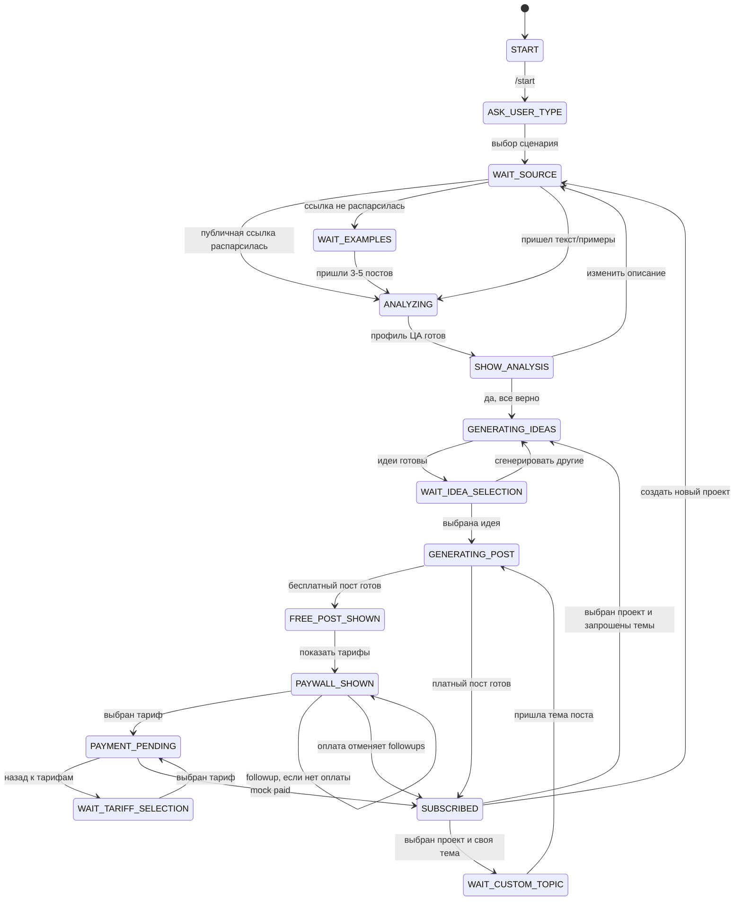

# Post Writer Bot

MVP Telegram-бота для генерации постов после короткого анализа аудитории.

## Запуск

1. Скопируйте env:

```bash
cp .env.example .env
```

2. Укажите `BOT_TOKEN` в `.env`.

3. Запустите сервисы:

```bash
docker compose up --build
```

API healthcheck:

```bash
curl http://localhost:8000/health
```

Если `OPENAI_API_KEY` не задан, бот использует mock LLM-ответы. Это удобно для проверки MVP-воронки без расходов на API.
Если `BOT_TOKEN` пустой, контейнеры `bot` и `scheduler` стартуют, но polling и отправка followup-сообщений отключаются.

## Env

- `BOT_TOKEN` - токен Telegram-бота.
- `DATABASE_URL` - PostgreSQL DSN, по умолчанию docker-compose использует локальный Postgres.
- `REDIS_URL` - Redis DSN для RQ.
- `AUTO_INIT_DB` - `true` автоматически создает таблицы и seed-тарифы при старте. Для Supabase production используйте `false` и применяйте SQL-миграции отдельно.
- `OPENAI_API_KEY` - ключ OpenAI или совместимого API.
- `OPENAI_BASE_URL` - опциональный base URL для OpenAI-compatible endpoint.
- `OPENAI_MODEL` - модель, по умолчанию `gpt-4o-mini`.
- `FOLLOWUP_FAST_MODE` - `true` включает короткие интервалы догрева для тестов.
- `MOCK_PAYMENTS` - `true` включает mock-оплаты.
- `APP_ENV` - окружение, по умолчанию `local`.

## Проверка сценария

1. Напишите боту `/start`.
2. Выберите сценарий.
3. Отправьте описание ниши или 3-5 примеров постов.
4. Дождитесь анализа аудитории.
5. Подтвердите анализ.
6. Выберите идею.
7. Получите бесплатный пост.
8. Выберите тариф.
9. Нажмите `Оплатить / mock paid`.

Проверить таблицы и тарифы:

```bash
docker compose exec db psql -U postgres -d post_writer_bot -c "\dt"
docker compose exec db psql -U postgres -d post_writer_bot -c "select * from tariffs;"
```

## Перенос базы в Supabase

Приложение уже использует PostgreSQL через SQLAlchemy/asyncpg, поэтому для Supabase нужно перенести схему/данные и поменять `DATABASE_URL`.

Для текущего Docker-приложения удобнее использовать Session Pooler Supabase на порту `5432` или direct connection, если сервер поддерживает IPv6. Transaction Pooler на порту `6543` тоже поддержан в коде: для него автоматически включается `NullPool` и отключается cache prepared statements.

1. Экспортируйте данные из локального Postgres:

```bash
./scripts/export_supabase_data.sh
```

Скрипт создаст:

```text
tmp/supabase_migration/post_writer_bot_data.sql
tmp/supabase_migration/source_counts.txt
```

2. В Supabase Dashboard откройте `Connect` и возьмите Postgres connection string. Для restore используйте psql-совместимый URL, например:

```bash
export SUPABASE_DB_URL='postgresql://postgres.<project-ref>:<password>@aws-0-<region>.pooler.supabase.com:5432/postgres?sslmode=require'
```

Пароль в URL должен быть percent-encoded, если в нем есть спецсимволы.

3. Примените схему, данные и RLS:

```bash
./scripts/restore_to_supabase.sh
```

Скрипт рассчитан на пустой Supabase project без этих таблиц. Он применяет `app/db/migrations/0001_initial.sql`, загружает data dump, включает RLS через `app/db/migrations/0003_enable_rls.sql`, запускает `vacuum analyze` и печатает counts по таблицам.

Если нужно создать пустую базу без локальных данных, выполните:

```bash
psql "$SUPABASE_DB_URL" -v ON_ERROR_STOP=1 -f app/db/migrations/0001_initial.sql
psql "$SUPABASE_DB_URL" -v ON_ERROR_STOP=1 -f app/db/migrations/0002_seed_tariffs.sql
psql "$SUPABASE_DB_URL" -v ON_ERROR_STOP=1 -f app/db/migrations/0003_enable_rls.sql
```

4. Запустите приложение без локального Postgres:

```bash
cp .env.supabase.example .env
# заполните DATABASE_URL, BOT_TOKEN, OPENAI_API_KEY
docker compose -f docker-compose.supabase.yml up --build
```

Для runtime `DATABASE_URL` можно указать как обычный Supabase Postgres URL (`postgres://` или `postgresql://`): приложение нормализует его в `postgresql+asyncpg://`. Для asyncpg используйте `ssl=require`; если оставите `sslmode=require`, приложение также преобразует параметр.

В Supabase включен RLS для таблиц в `public`. Политики не добавлены, потому что бот работает через backend Postgres connection, а не через Supabase Auth/Data API; это закрывает таблицы от `anon`/`authenticated` через REST до появления осознанной модели доступа.

Проверить основные таблицы после ручного сценария:

```sql
select * from users;
select * from projects;
select * from audience_profiles;
select * from ideas;
select * from posts;
select * from payments;
select * from subscriptions;
select * from followup_events;
```

## Автомат состояний



## Fast followup mode

Для ускоренной проверки догрева установите:

```env
FOLLOWUP_FAST_MODE=true
```

В этом режиме followup-сообщения планируются через минуты, а не часы.
По умолчанию fast-mode использует интервалы 2, 5, 10, 20, 30 и 47 минут.
